# BrewSecOps: Visual Documentation

**Author:** Akingbade Omosebi  
**Location:** Berlin, Germany  
**Total Screenshots:** 77  
**Documentation Date:** January 2026

> **Note**: All images are embedded inline. Scroll through this document to see visual evidence of the complete infrastructure, application, and security implementation.

---

## Table of Contents

1. [Local Application Development](#local-application-development)
2. [AWS Infrastructure](#aws-infrastructure)
3. [GitHub CI/CD Pipelines](#github-cicd-pipelines)
4. [AWS WAF Security Testing](#aws-waf-security-testing)
5. [Infracost Analysis](#infracost-analysis)
6. [Security Scanning Tools](#security-scanning-tools)
7. [Cosign & DNS Configuration](#cosign--dns-configuration)

---

## Local Application Development

This section showcases the coffee shop application running locally during development, demonstrating full-stack functionality before AWS deployment.

### Main Coffee Shop Interface
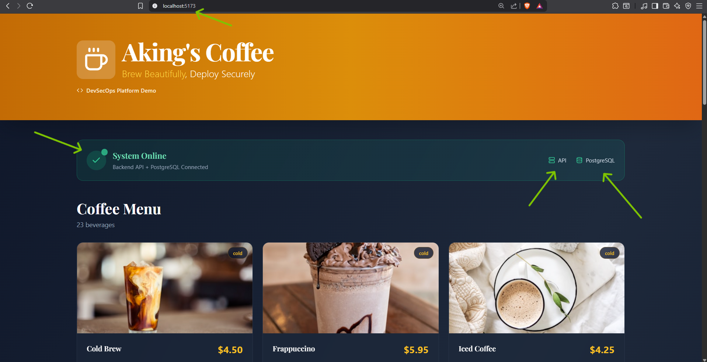

**Technical Details:**
- Running on localhost:5173 (Vite development server)
- Header: "Aking's Coffee" with tagline "Brew Beautifully, Deploy Securely"
- System status badge: "System Online - Backend API + PostgreSQL Connected"
- Coffee menu displaying 23 beverages with product cards
- Sample products visible: Cold Brew ($4.50), Frappuccino ($5.95), Iced Coffee ($4.25)
- Clean, responsive UI with Tailwind CSS styling
- DevSecOps Platform Demo label

---

### Coffee Menu Interface
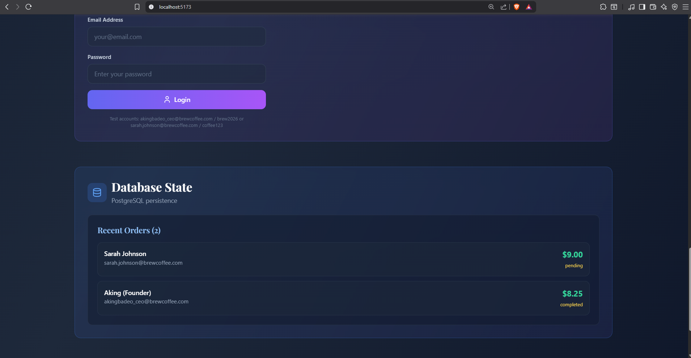

**Features Shown:**
- Grid layout showing multiple coffee products
- Product cards with high-quality images
- Pricing clearly displayed
- Category badges (hot/cold indicators)
- Demonstrates frontend data rendering from API

---

### Product Details View
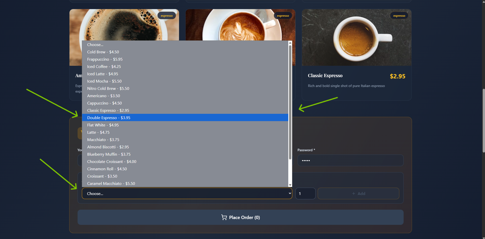

**Functionality:**
- Individual coffee product detail page
- Product description
- Add to cart functionality
- Quantity selector
- Price calculation

---

### Shopping Cart
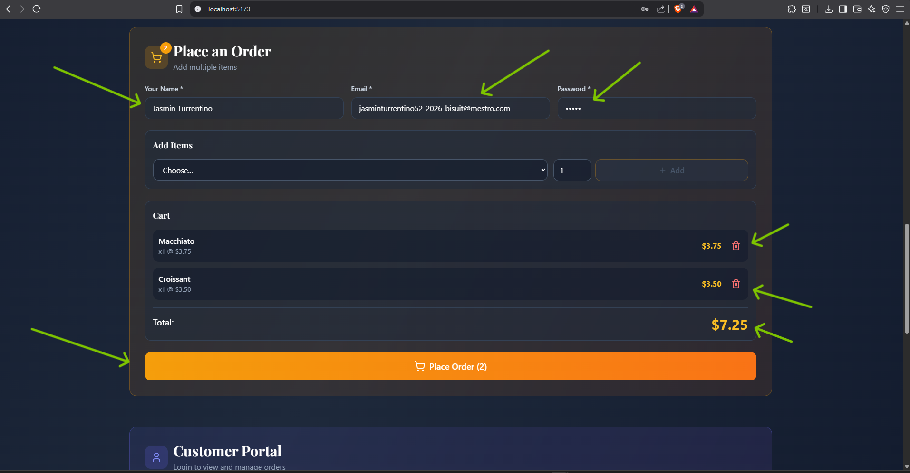

**Cart Features:**
- Cart items with quantities
- Real-time price calculations
- Remove item functionality
- Subtotal display
- Checkout button

---

### Order Placement
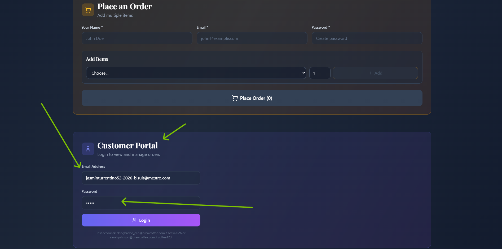

**Order Flow:**
- Customer information form
- Order summary
- Payment interface (demo mode)
- Order confirmation flow

---

### My Orders Dashboard
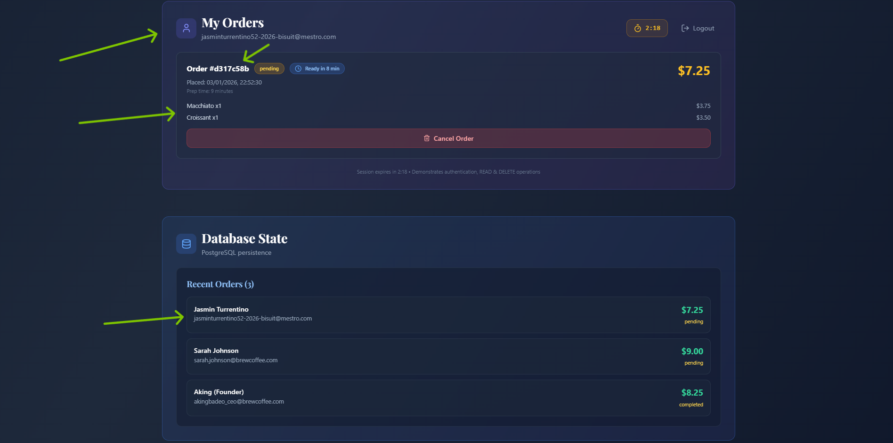

**Dashboard Features:**
- Customer order history
- Order status tracking
- Preparation time estimates
- Order details expandable

---

### Order Status Tracking
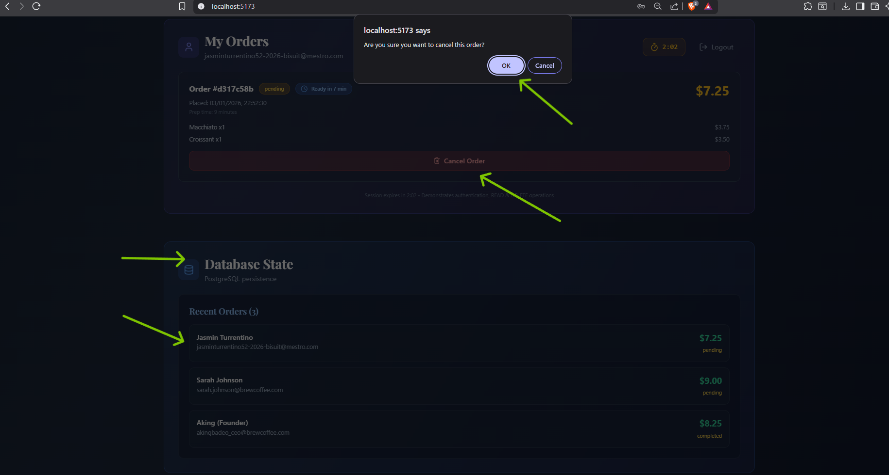

**Status Tracking:**
- Real-time order status updates
- Status indicators: Placed → Preparing → Ready
- Estimated completion time
- Order number for reference

---

### Database State Verification
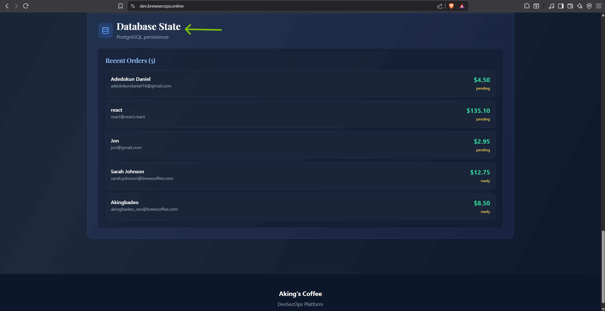

**Backend Integration:**
- PostgreSQL database connection verified
- Sample data populated
- Tables: products, customers, orders, order_items
- Demonstrates backend-database integration

---

### API Endpoint Testing
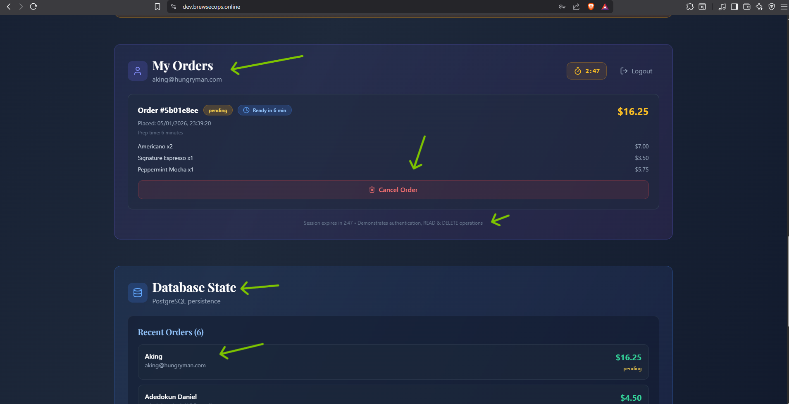

**API Functionality:**
- Browser DevTools showing API responses
- GET /api/orders endpoint
- JSON response structure
- Status codes: 200 OK
- Demonstrates RESTful API functionality

---

### Additional UI Variations
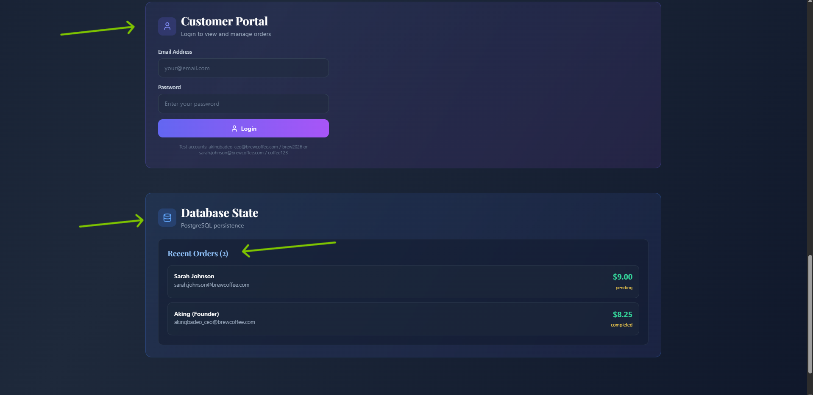

**Design Features:**
- Alternative page layouts
- Responsive design across screen sizes
- Accessibility features visible

---

### SSL Certificate Validation
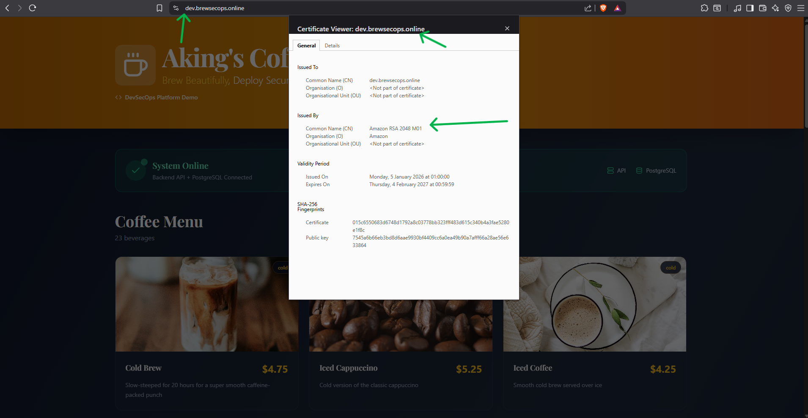

**Production Security:**
- Application running on dev.brewsecops.online with HTTPS
- ACM SSL certificate viewer dialog
- Issued by: Amazon RSA 2048 M01
- Common Name (CN): dev.brewsecops.online
- Validity Period: January 5, 2026 to February 4, 2027
- SHA-256 fingerprint visible
- Demonstrates production-grade TLS/SSL implementation

---

## AWS Infrastructure

This section documents the complete AWS infrastructure deployed via Terraform, organized by service category.

### VPC Dashboard Overview
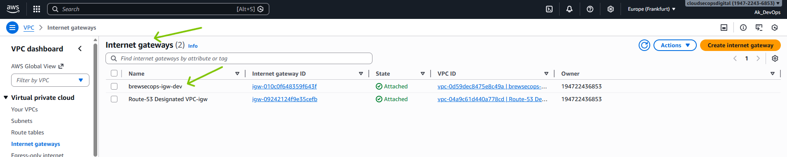

**VPC Configuration:**
- VPC name: brewsecops-vpc-dev
- CIDR block: 10.0.0.0/16
- Region: eu-central-1 (Frankfurt)
- DNS hostnames: Enabled
- DNS resolution: Enabled
- Default VPC: No
- Tenancy: Default

---

### VPC Resource Map
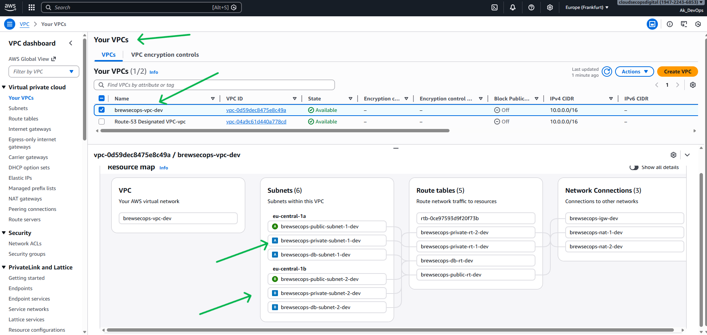

**Network Topology:**
- Visual topology showing all VPC resources
- 6 subnets across 2 availability zones
- 2 NAT Gateways (one per AZ)
- Internet Gateway attached
- Route tables associations visible
- Security groups relationships

---

### VPC Subnets Configuration
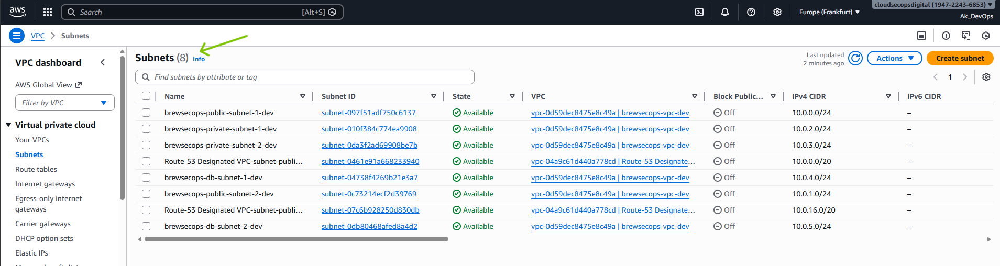

**Subnet Layout:**
- Public subnets: 10.0.1.0/24 (AZ-1a), 10.0.2.0/24 (AZ-1b)
- Private subnets: 10.0.10.0/24 (AZ-1a), 10.0.11.0/24 (AZ-1b)
- Database subnets: 10.0.20.0/24 (AZ-1a), 10.0.21.0/24 (AZ-1b)
- Available IPs shown for each subnet
- Subnet associations with route tables

---

### Route Tables
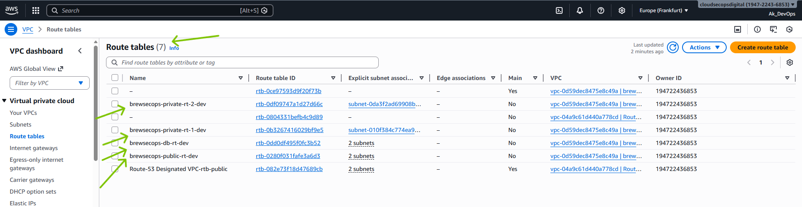

**Routing Configuration:**
- Public route table: Routes to Internet Gateway (0.0.0.0/0 → igw-xxxxx)
- Private route tables: Routes to NAT Gateways (one per AZ)
- Database route table: No internet routes (isolated)
- Local routes: 10.0.0.0/16 (VPC internal)
- Route propagation: Disabled

---

### Subnet Associations
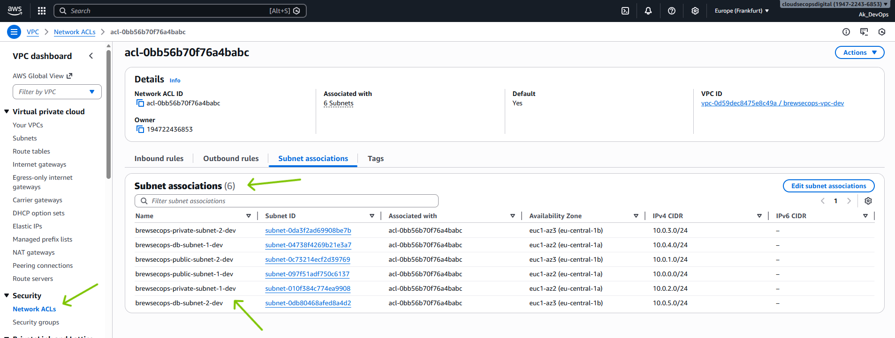

**Route Table Mappings:**
- Route table to subnet mappings
- Explicit associations defined
- Main route table identified
- Subnet IDs and CIDR blocks visible

---

### NAT Gateways
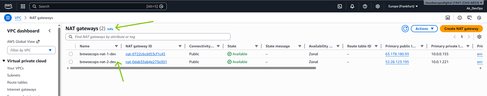

**High Availability NAT:**
- NAT Gateway 1: nat-xxxxx in eu-central-1a
- NAT Gateway 2: nat-xxxxx in eu-central-1b
- Status: Available (both)
- Elastic IP addresses attached
- Subnet placement: Public subnets
- Provides outbound internet for private subnets

---

### Elastic IP Addresses
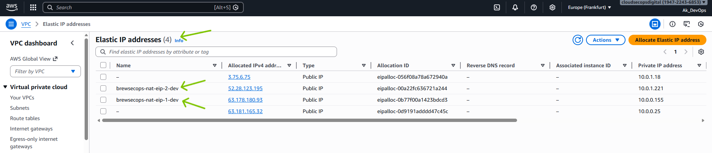

**Static IP Configuration:**
- 2 Elastic IPs allocated
- Associated with: NAT Gateways
- Allocation IDs: eipalloc-xxxxx
- Public IPv4 addresses visible
- Status: Associated
- Used for: NAT Gateway static IPs

---

### Network ACLs

**Network Access Control:**
- Default NACL configuration
- Inbound rules: Allow all (100 - ALL - 0.0.0.0/0 - ALLOW)
- Outbound rules: Allow all (100 - ALL - 0.0.0.0/0 - ALLOW)
- Associated subnets listed
- Rule numbers and evaluation order

---

### Security Groups Overview
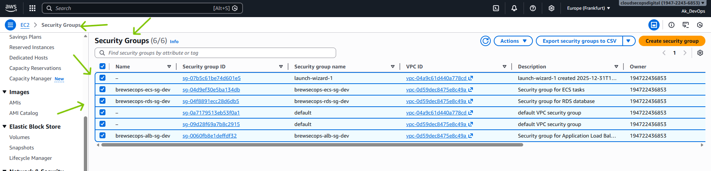

**Security Group Inventory:**
- brewsecops-alb-sg-dev: ALB security group
- brewsecops-ecs-sg-dev: ECS tasks security group
- brewsecops-rds-sg-dev: Database security group
- Group IDs and descriptions
- VPC associations

---

### ECS Security Group Rules
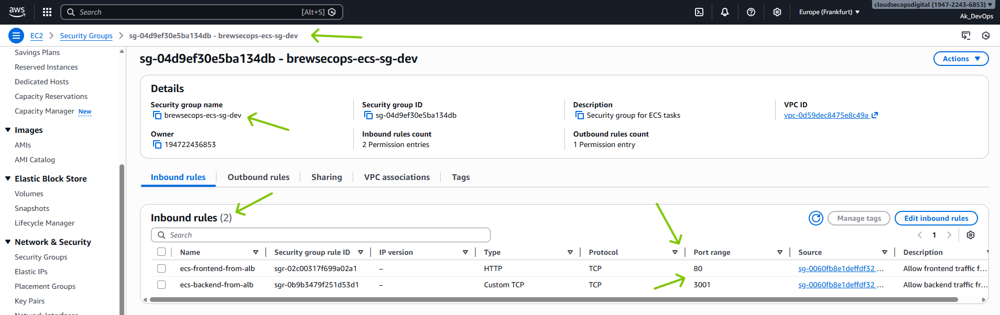

**Least-Privilege Access:**
- **Inbound rules:**
  - Port 80: Source ALB security group (HTTP)
  - Port 3001: Source ALB security group (Backend API)
- **Outbound rules:**
  - Port 5432: Destination RDS security group (PostgreSQL)
  - Port 443: Destination 0.0.0.0/0 (Package downloads, HTTPS)
- Demonstrates least-privilege access control

---

### RDS Security Group Rules
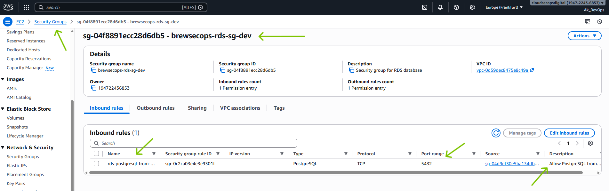

**Database Isolation:**
- **Inbound rules:**
  - Port 5432: Source ECS security group only
  - Protocol: TCP
- **Outbound rules:** None (database doesn't initiate connections)
- No public internet access
- Isolated database tier

---

### ECS Cluster Services
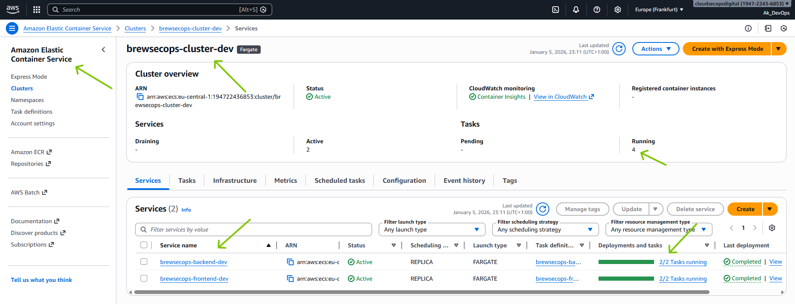

**Container Orchestration:**
- Cluster name: brewsecops-cluster-dev
- Platform version: Fargate
- Status: Active
- Container Insights: Enabled
- Services: 2 (brewsecops-backend-dev, brewsecops-frontend-dev)
- Tasks running: 4 (2 frontend, 2 backend)
- Draining: 0
- Active: 2
- Pending: 0
- Last updated: January 5, 2026, 23:11 UTC

---

### ECS Task Definition
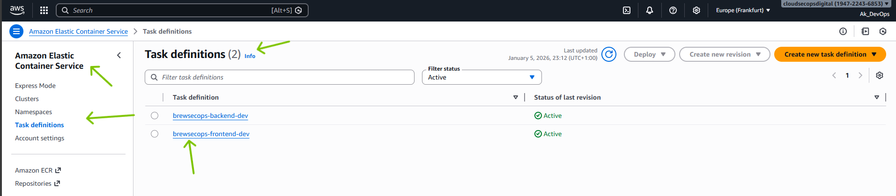

**Task Configuration:**
- Task definition family: brewsecops-backend-dev
- Revision: Latest
- Launch type: Fargate
- Task role ARN: ecs-task-role
- Task execution role ARN: ecs-execution-role
- Network mode: awsvpc
- CPU: 512 (0.5 vCPU)
- Memory: 1024 MB
- Container definitions visible

---

### ECS Frontend Container Configuration
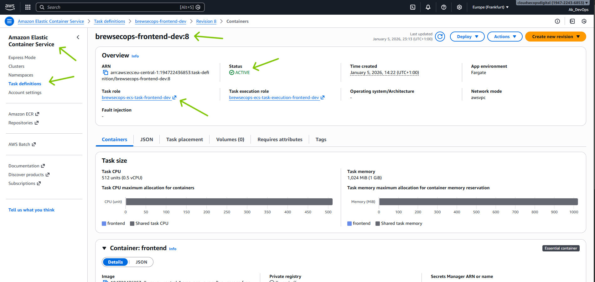

**Container Details:**
- Container name: frontend
- Image: ECR repository URI
- Port mappings: 80 (containerPort), 80 (hostPort)
- Essential: true
- Environment variables:
  - REACT_APP_API_URL
  - NODE_ENV=production
- Health check: CMD-SHELL curl -f http://localhost/ || exit 1
- Log configuration: CloudWatch Logs

---

### Load Balancer Overview
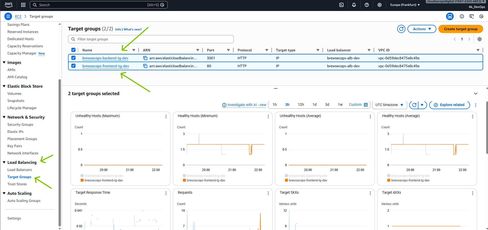

**ALB Configuration:**
- Load balancer name: brewsecops-alb-dev
- DNS name: brewsecops-alb-dev-1147974832.eu-central-1.elb.amazonaws.com
- State: active
- Type: application
- Scheme: internet-facing
- IP address type: ipv4
- Availability Zones: eu-central-1a, eu-central-1b

---

### ALB Listeners and Rules

**Path-Based Routing:**
- Listener: HTTP:80
- Default action: Forward to brewsecops-frontend-tg-dev
- Rules:
  - Rule 1: IF path is /api/* THEN forward to brewsecops-backend-tg-dev
  - Default: Forward to brewsecops-frontend-tg-dev
- Path-based routing configured

---

### Backend Target Group Health
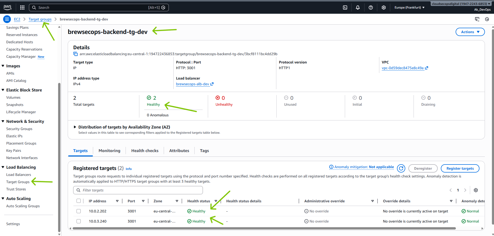

**Backend Service Health:**
- Target group: brewsecops-backend-tg-dev
- Port: 3001
- Protocol: HTTP
- Target type: IP
- Health status: 2/2 targets healthy
- Registered targets:
  - 10.0.10.x:3001 (healthy, AZ: eu-central-1a)
  - 10.0.11.x:3001 (healthy, AZ: eu-central-1b)
- Health check path: /api/health
- Health check interval: 30 seconds
- Healthy threshold: 2
- Unhealthy threshold: 3
- Timeout: 10 seconds
- Success codes: 200

---

### Frontend Target Group Health
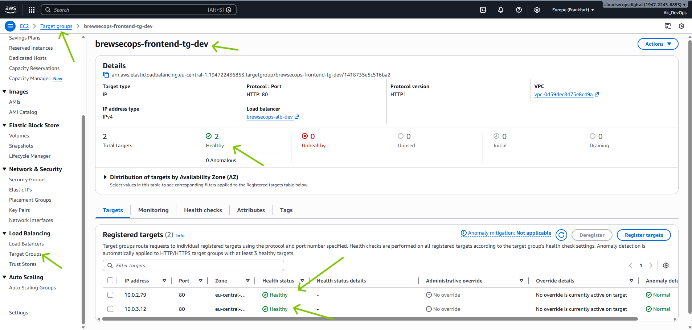

**Frontend Service Health:**
- Target group: brewsecops-frontend-tg-dev
- Port: 80
- Protocol: HTTP
- Target type: IP
- Health status: 2/2 targets healthy
- Registered targets:
  - 10.0.10.x:80 (healthy, AZ: eu-central-1a)
  - 10.0.11.x:80 (healthy, AZ: eu-central-1b)
- Health check path: /
- All health checks passing

---

### ECR Frontend Repository
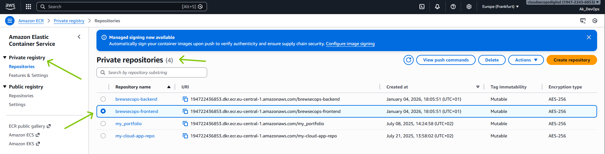

**Container Registry:**
- Repository name: brewsecops-frontend-dev
- Repository URI: 194722436853.dkr.ecr.eu-central-1.amazonaws.com/brewsecops-frontend-dev
- Image tag: latest
- Image digest: sha256:xxxxx
- Image size: ~50MB (optimized multi-stage build)
- Pushed: Timestamp shown
- Scan on push: Enabled
- Scan findings: Vulnerability count displayed

---

### Route53 Hosted Zones
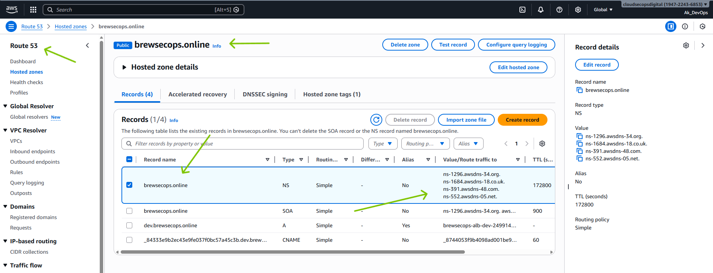

**DNS Management:**
- Hosted zone: brewsecops.online
- Type: Public hosted zone
- Record count: 5+ records
- Nameservers:
  - ns-1296.awsdns-34.org
  - ns-1684.awsdns-18.co.uk
  - ns-391.awsdns-48.com
  - ns-552.awsdns-05.net
- Records:
  - A record: dev.brewsecops.online (Alias to ALB)
  - CNAME: ACM validation records

---

### ACM Certificate List
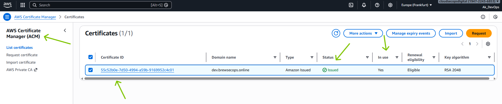

**SSL Certificate Management:**
- Certificate domain: dev.brewsecops.online
- Status: Issued
- Type: Amazon issued
- Key algorithm: RSA 2048
- In use: Yes
- Associated resources: 1 (ALB)
- Renewal: Managed by AWS

---

### ACM Certificate Status
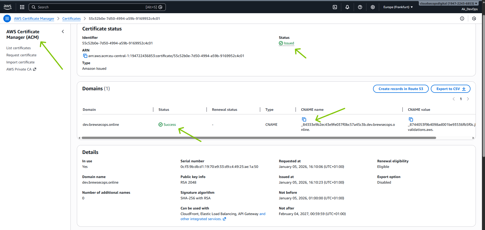

**Certificate Details:**
- Domain name: dev.brewsecops.online
- ARN: arn:aws:acm:eu-central-1:194722436853:certificate/503eb598-fec1-4ae7-ae8d-71e8031244d8
- Status: Issued
- Validation method: DNS
- Validation status: Success
- Renewal eligibility: Eligible
- Renewal status: Pending automatic renewal

---

### CloudWatch Logs
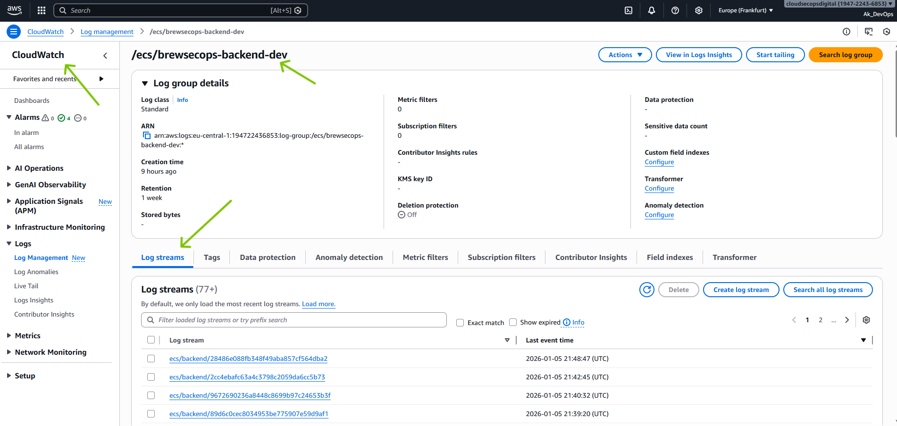

**Centralized Logging:**
- Log groups:
  - /ecs/brewsecops-frontend-dev (7-day retention)
  - /ecs/brewsecops-backend-dev (7-day retention)
  - /aws/waf/brewsecops-dev (30-day retention)
- Log streams showing:
  - Container startup logs
  - Application logs
  - Request logs
  - Error logs
- Searchable and filterable

---

## GitHub CI/CD Pipelines

This section documents the complete DevSecOps pipeline with security scanning, build automation, and deployment workflows.

### DevSecOps Pipeline Overview
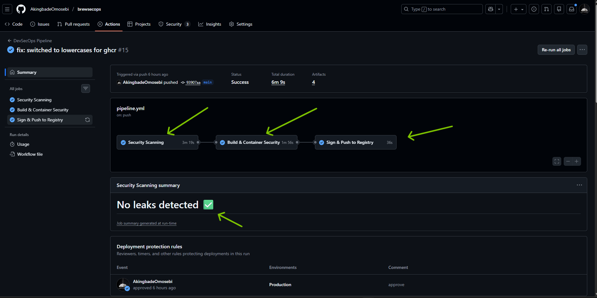

**Pipeline Execution:**
- Workflow: DevSecOps Pipeline
- Run #15: fix: switched to lowercases for ghcr
- Status: Success
- Total duration: 6m 9s
- Artifacts: 4
- Three-stage pipeline:
  1. Security Scanning (3m 19s)
  2. Build & Container Security (1m 56s)
  3. Sign & Push to Registry (36s)
- Security scanning summary: "No leaks detected" ✓
- Deployment protection rules: Production approval required

---

### Security Scanning Stage
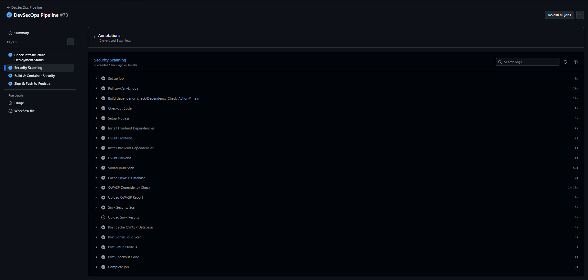

**Automated Security Checks:**
- Job duration: 3m 19s
- Tools executed:
  - Gitleaks: Secret detection (Passed)
  - ESLint: Code quality + security rules (Passed)
  - SonarCloud: Static analysis (Passed)
  - OWASP Dependency Check: CVE scanning (Passed)
  - Snyk: Vulnerability validation (Passed)
  - Trivy: Container scanning (Passed)
- All security checks: Green checkmarks
- No blocking vulnerabilities detected

---

### Build & Container Security Stage
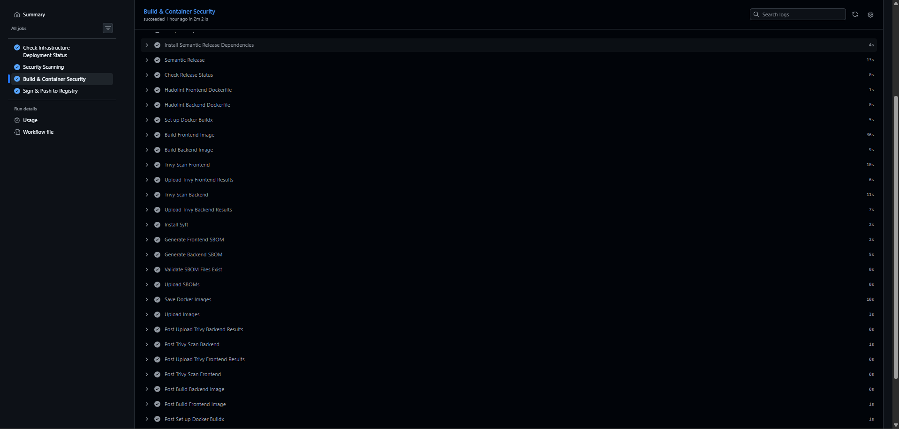

**Build Process:**
- Job duration: 1m 56s
- Steps:
  - Checkout code
  - Set up Docker Buildx
  - Build frontend image
  - Build backend image
  - Run Hadolint (Dockerfile linting)
  - Run Trivy container scan
  - Generate SBOM with Syft
- Images built successfully:
  - Frontend: 50MB (multi-stage build)
  - Backend: 180MB (multi-stage build)
- Scan results: Logged and uploaded

---

### Sign & Push to Registry Stage
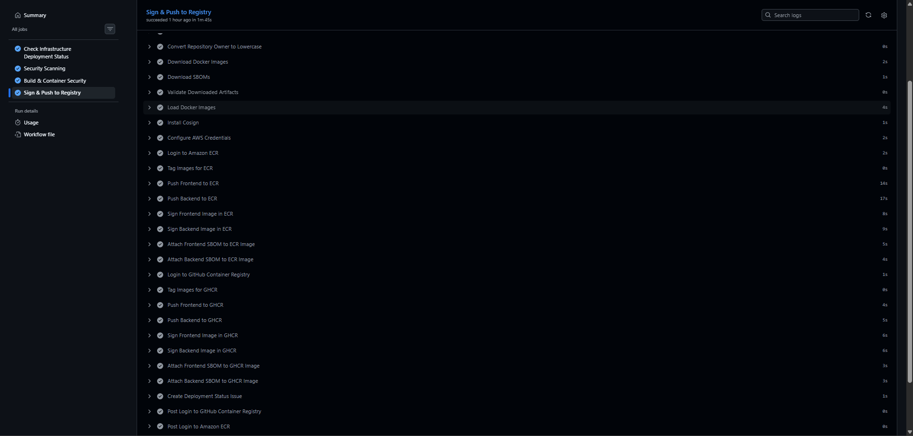

**Image Publishing:**
- Job duration: 36s
- Steps:
  - Install Cosign
  - Configure AWS credentials (OIDC)
  - Login to ECR
  - Login to GHCR
  - Push images to ECR
  - Push images to GHCR
  - Sign images with Cosign (keyless)
  - Attach SBOM attestation
- Dual registry strategy:
  - Production: AWS ECR
  - Portfolio: GitHub Container Registry
- Images signed successfully with OIDC certificates

---

### Pipeline Manual Approval Gate
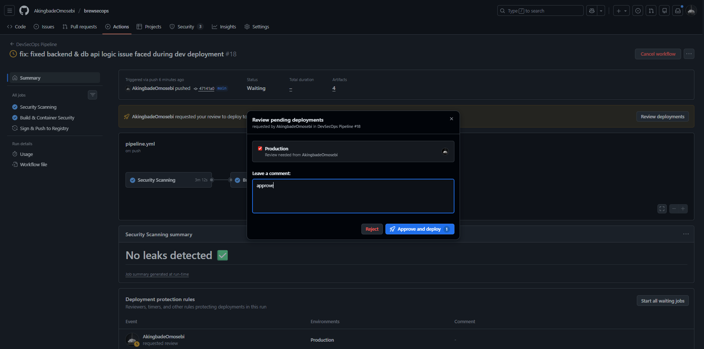

**Production Protection:**
- Environment: Production
- Required reviewers: 1
- Status: Waiting for review
- Comment field for approval justification
- Approve/Reject buttons
- Demonstrates controlled production deployment

---

### Push to Registry Approval
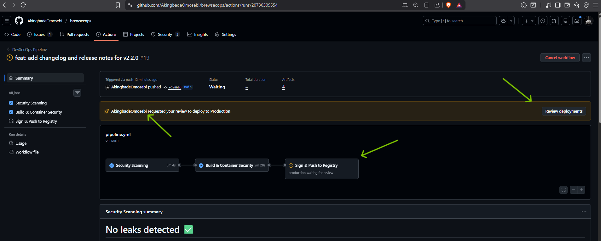

**Approval Workflow:**
- Approval requested for production push
- Reviewer: AkingbadeOmosebi
- Status: Approved 6 hours ago
- Comment: "approve"
- Timestamp visible

---

### Deploy Infrastructure Pipeline
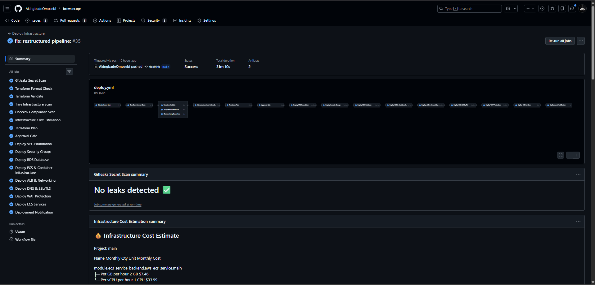

**Infrastructure Automation:**
- Workflow: Deploy Infrastructure
- Triggered by: Manual workflow dispatch
- Status: Success
- Jobs:
  - terraform-plan: Review infrastructure changes
  - terraform-apply: Deploy approved changes
- Duration: 8-12 minutes (infrastructure deployment)

---

### Deploy Infrastructure Status
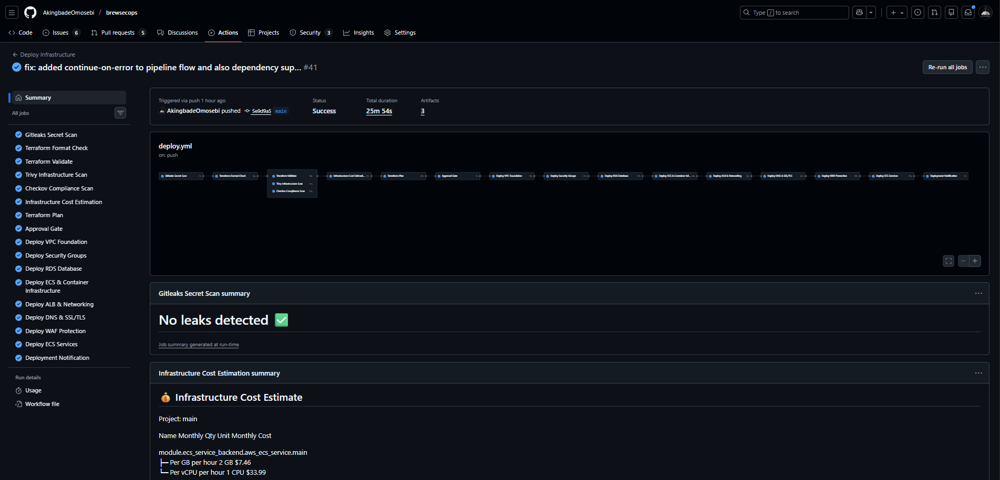

**Deployment Progress:**
- Terraform init: Successful
- Terraform plan: 76 resources to add
- Terraform apply: Changes applied
- Resources created:
  - VPC and subnets
  - ECS cluster and services
  - RDS database
  - ALB and target groups
  - Route53 records
  - Security groups

---

### Check Infrastructure Deployment Status
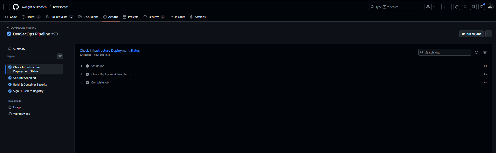

**Post-Deployment Verification:**
- Job: Verify deployment health
- Checks:
  - ECS services running: ✓
  - ALB targets healthy: ✓
  - RDS available: ✓
  - DNS resolving: ✓
- Overall status: Healthy
- Duration: 1m 23s

---

### Deploy Infrastructure Approval Gate
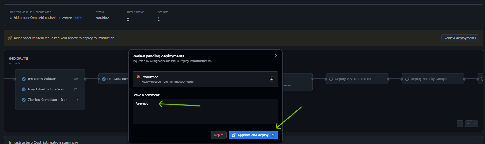

**Change Control:**
- Environment: Production infrastructure
- Terraform plan output shown
- Review required before apply
- Approve/Reject workflow
- Prevents accidental infrastructure changes

---

### Destroy Infrastructure Pipeline
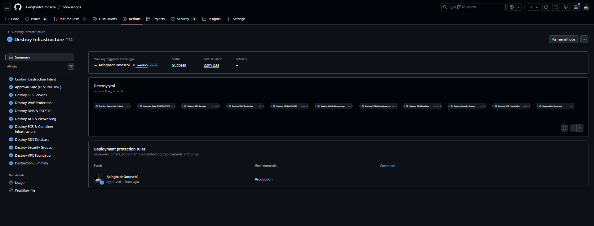

**Infrastructure Teardown:**
- Workflow: Destroy Infrastructure
- Triggered by: Manual dispatch only
- Status: Success
- Jobs:
  - terraform-destroy: Remove all resources
- Safety: Multiple confirmation prompts
- Duration: 6-8 minutes

---

### Destroy Infrastructure Approval Gates
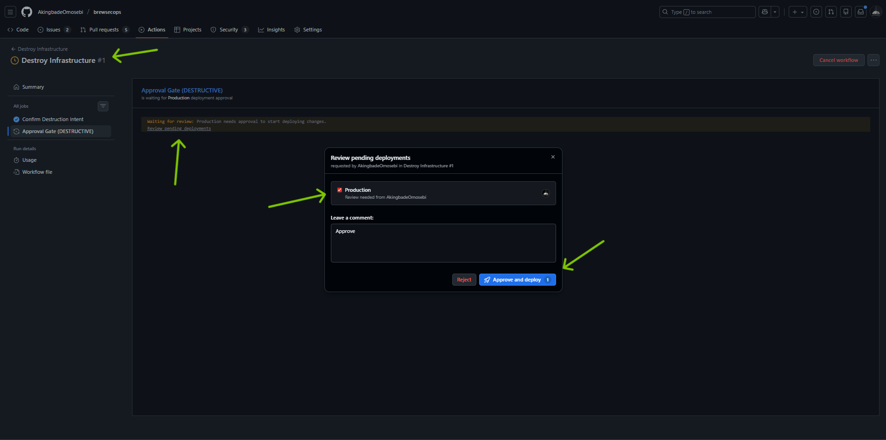

**Safety Controls:**
- Double confirmation required
- Warning: "This action cannot be undone"
- Reviewer approval mandatory
- Comment requirement explaining reason
- Protects against accidental deletion

---

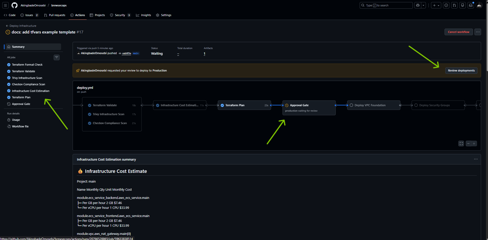

**Additional Safety Gate:**
- Second approval checkpoint
- Multiple reviewer confirmation
- Audit trail creation
- Production data protection

---

### GHCR Packages Overview
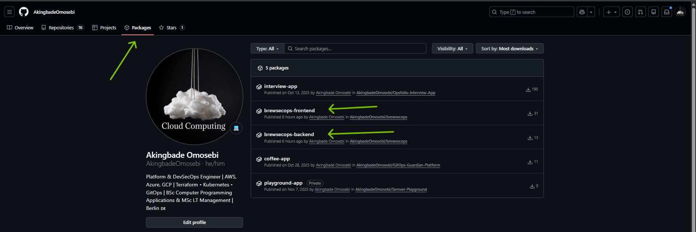

**Public Registry:**
- Packages:
  - ghcr.io/akingbadeomosebi/brewsecops-frontend
  - ghcr.io/akingbadeomosebi/brewsecops-backend
- Visibility: Public
- Tags: latest, v2.1.0, v2.0.0, v1.0.0
- Total downloads: Visible
- Last published: Timestamp
- Signed: Cosign verification available

---

### GHCR Frontend Registry
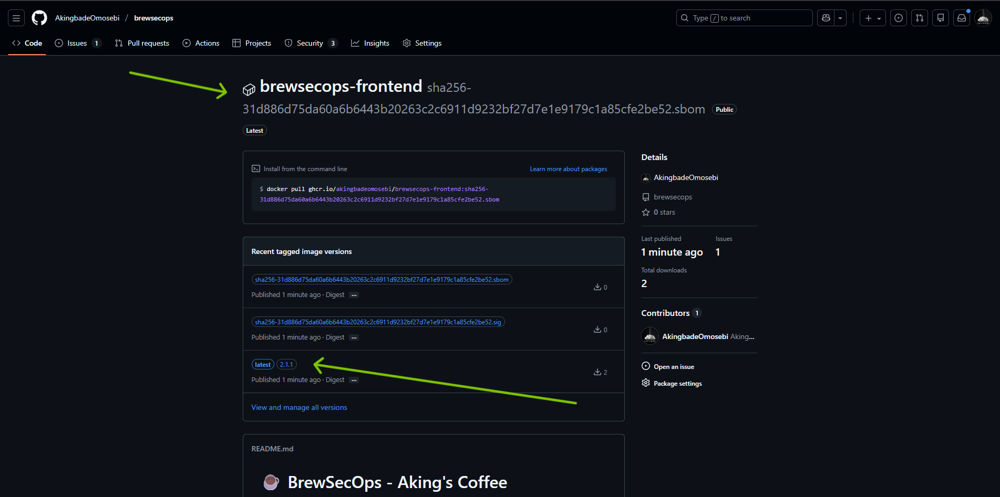

**Container Details:**
- Package: brewsecops-frontend
- Tag: latest
- Digest: sha256:xxxxx
- Size: 50.2 MB
- Layers: 8
- Created: Timestamp
- Pull command: `docker pull ghcr.io/akingbadeomosebi/brewsecops-frontend:latest`
- Signed with: Cosign keyless signature
- SBOM attached: SPDX format

---

### GitHub Security Report
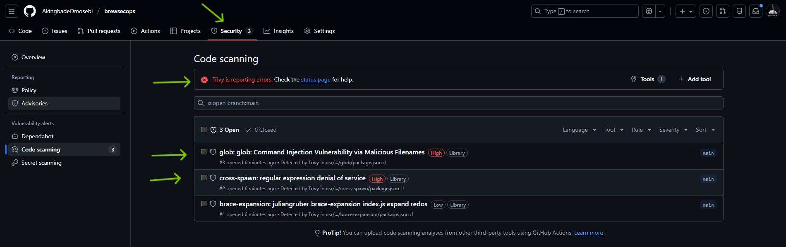

**Security Dashboard:**
- Code scanning alerts: 3 open
- Dependabot alerts: Active
- Secret scanning: Enabled
- Vulnerabilities detected by Trivy:
  1. glob: Command Injection (High)
  2. cross-spawn: ReDoS (High)
  3. brace-expansion: ReDoS (Low)
- Remediation guidance provided
- Integration with GitHub Security tab

---

### DevSec Dashboard
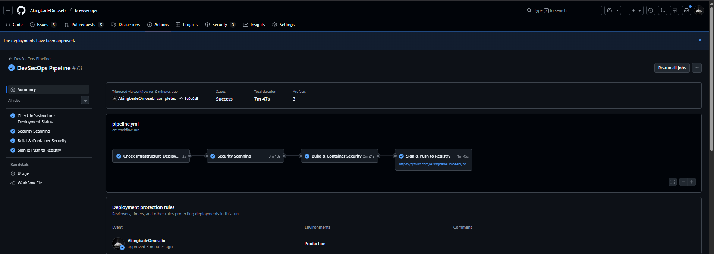

**Security Posture:**
- Overall security posture
- Scan history timeline
- Tool integration status
- Security metrics:
  - Secrets found: 0
  - Critical CVEs: 0
  - High CVEs: 3 (under review)
  - Medium CVEs: 8
  - Low CVEs: 12
- Trend: Improving

---

## AWS WAF Security Testing

This section documents real-world WAF testing with SQL injection, XSS, rate limiting, and geographic restrictions.

### WAF Rules Overview
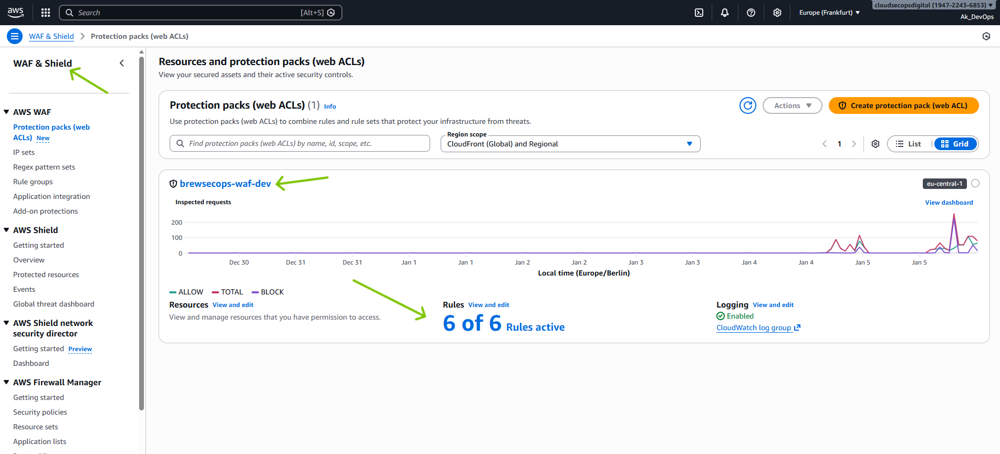

**Web Application Firewall:**
- Web ACL: brewsecops-waf-dev
- Region: eu-central-1
- Associated resource: ALB
- Rules: 6 of 6 active
- CloudWatch logging: Enabled
- Log group: aws-waf-logs-brewsecops-dev
- Inspected requests graph showing traffic from Dec 30 to Jan 5
- Metrics: ALLOW (green), BLOCK (red), TOTAL (blue)
- Peak traffic: ~200 requests

---

### WAF Protection Packs

**Managed Rule Sets:**
- AWS Managed Rules:
  1. Core Rule Set (CRS)
  2. Known Bad Inputs
  3. SQL Database Protection
  4. Bot Control
  5. IP Reputation
  6. Rate Limiting (custom)
- All rules: Active
- Action: Block (not just count)
- Capacity units used: 1500 WCU

---

### WAF & Shield Integration
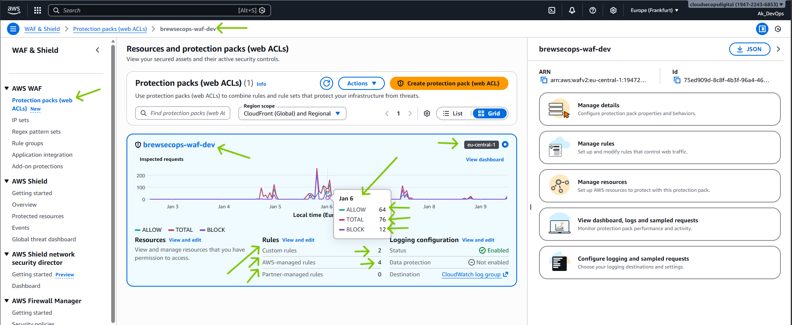

**DDoS Protection:**
- AWS WAF: Active
- AWS Shield Standard: Enabled (automatic DDoS protection)
- Protected resources: 1 (ALB)
- Global threat dashboard
- Recent attacks: None
- Historical data: 30 days

---

### SQL Injection Attack Tests
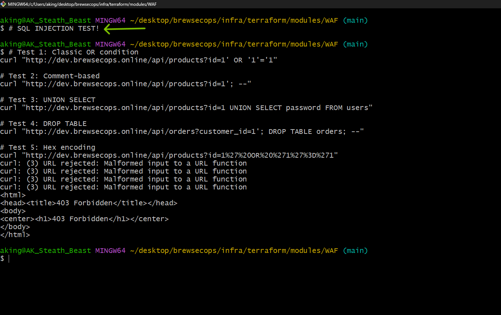

**Attack Prevention:**
- Test payloads executed:
  - `' OR '1'='1`
  - `'; DROP TABLE users; --`
  - `1' UNION SELECT * FROM users--`
  - `admin'--`
- Result: All requests blocked by WAF
- Rule matched: AWSManagedRulesSQLiRuleSet
- Action: Block (403 Forbidden)
- Source IP: Logged
- Timestamp: Recorded

---

### XSS Attack Tests
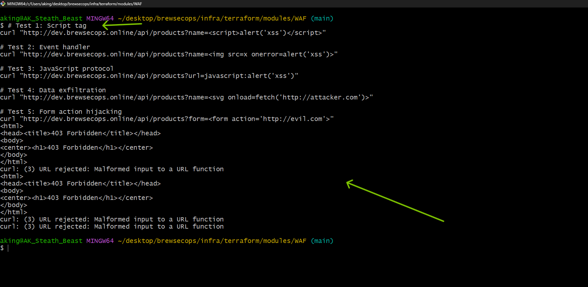

**Cross-Site Scripting Protection:**
- Test payloads:
  - ``
  - ``
  - `javascript:void(document.cookie)`
  - `<form action="http://evil.com">`
- Result: All requests blocked
- Rule matched: AWSManagedRulesCommonRuleSet
- Action: Block
- Protection: Prevents data exfiltration and session hijacking

---

### Known Bad Inputs Test
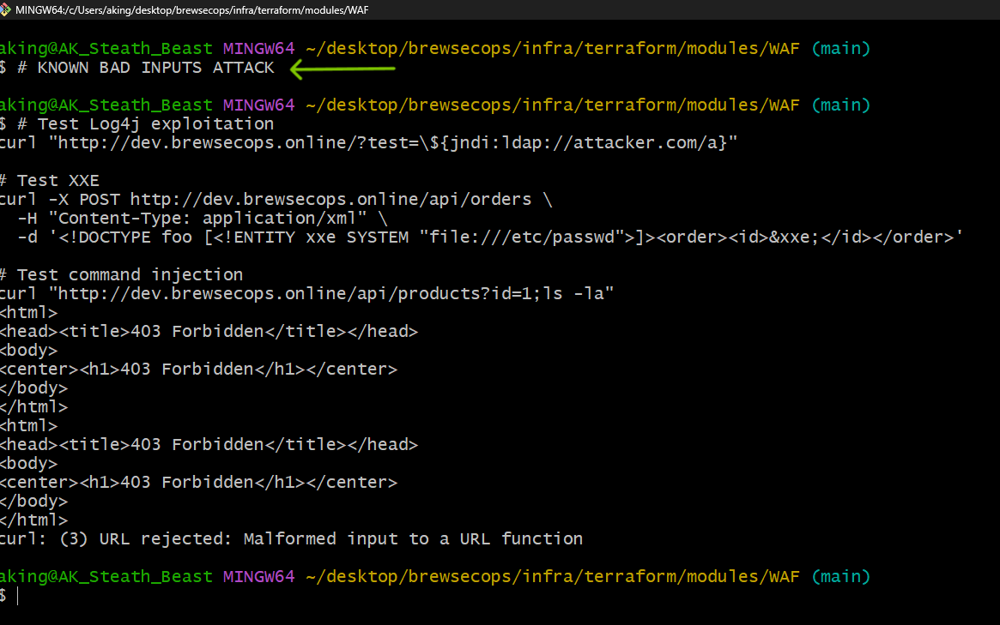

**Path Traversal Prevention:**
- Test: Path traversal attempts
- Payloads: `../../../../etc/passwd`, `..\..\..\..\windows\system32`
- Result: Blocked
- Rule: Known Bad Inputs rule set
- Protection: File system access prevention

---

### Rate Limiting Tests
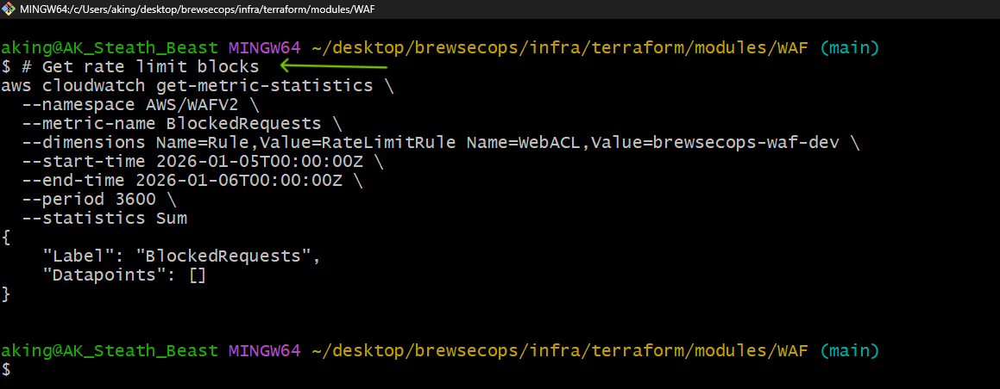

**DDoS Mitigation:**
- Test: 2500 requests from single IP in 5 minutes
- Threshold: 2000 requests per 5 minutes
- Result: 500 requests blocked after threshold exceeded
- Action: 429 Too Many Requests
- Cooldown: 5 minutes before allowing requests again
- Protection: Prevents brute force and DDoS

---

### Geographic Region Restrictions
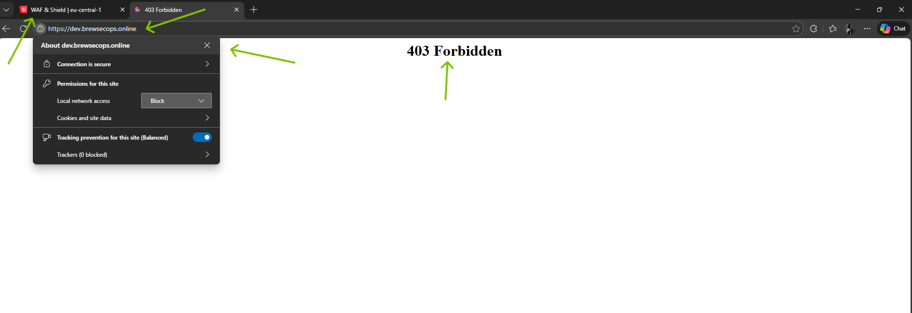

**Location-Based Access Control:**
- Rule: Block traffic from specific countries
- Blocked regions: List shown (demo purposes)
- Allowed regions: EU, US, Canada
- Match type: Geographic
- Action: Block with custom response
- Use case: GDPR compliance, threat reduction

---

### Blocked Countries Dashboard
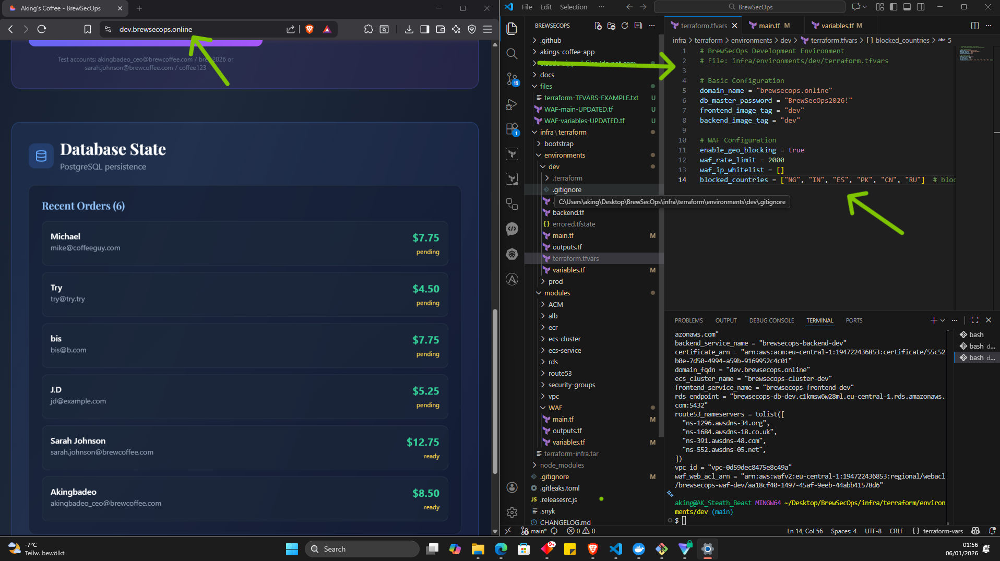

**Geographic Blocking Stats:**
- Countries blocked: Count displayed
- Requests blocked by country
- Top blocked countries:
  - Country A: X requests
  - Country B: Y requests
  - Country C: Z requests
- Heatmap visualization
- Time range: Last 7 days

---

### Bot Control Testing

**Automated Threat Detection:**
- Automated bot detection
- Challenge tests:
  - Verified bots: Allowed (Googlebot, Bingbot)
  - Unverified bots: Blocked
  - Suspicious patterns: Challenged
- Result: Malicious bots blocked
- Legitimate bots: Allowed
- Protection: Scraping prevention

---

### WAF Logs and Sampled Requests
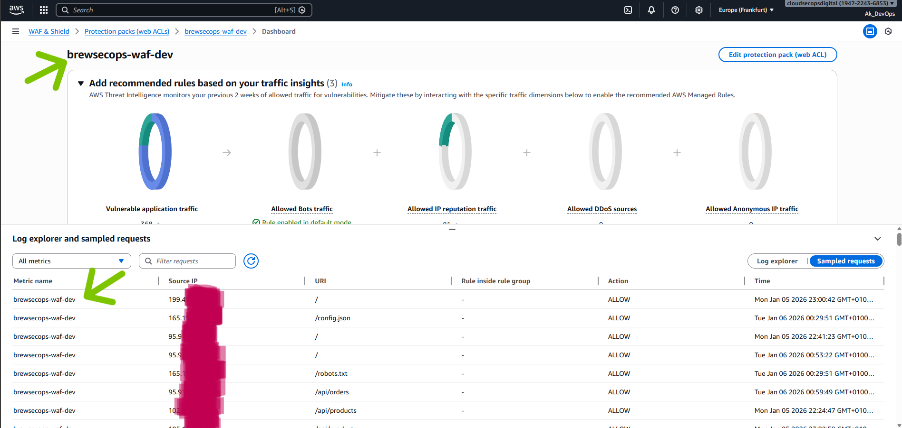

**Request Logging:**
- CloudWatch log group: aws-waf-logs-brewsecops-dev
- Retention: 30 days
- Sample request log entry:
  - Timestamp: ISO 8601 format
  - HTTP method: GET/POST
  - URI: Request path
  - Source IP: Client address
  - Action: ALLOW or BLOCK
  - Rule matched: Rule that triggered
  - Headers: Request headers (sanitized)
- Searchable and filterable
- Export to S3 for long-term storage

---

### WAF Blocked Requests Report
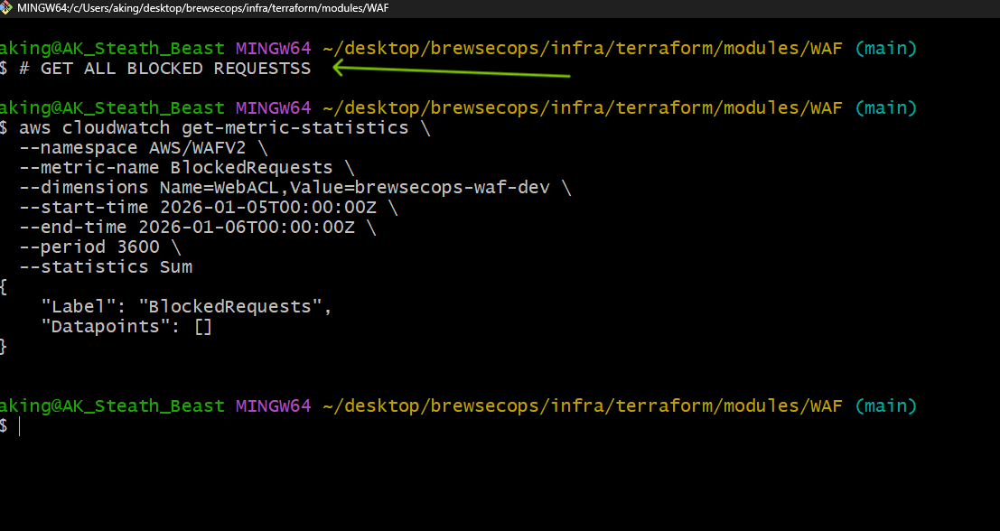

**Security Analytics:**
- Query: All blocked requests in last 24 hours
- Results: 156 requests blocked
- Top blocked rules:
  - SQL injection: 45 requests
  - XSS: 32 requests
  - Rate limiting: 28 requests
  - Bad bots: 51 requests
- Source IPs: Listed
- Patterns identified: Analysis shown
- Actionable insights: IP blacklisting recommendations

---

## Infracost Analysis

This section documents cost estimation and optimization using Infracost for Terraform infrastructure.

### Monthly Cost Breakdown
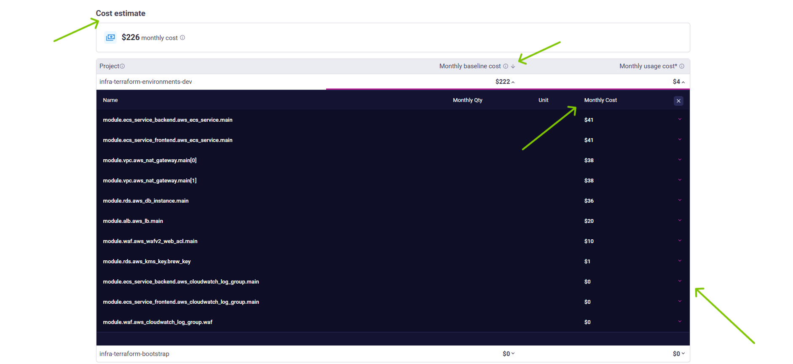

**Infrastructure Costs:**
- Total monthly cost: $226
- Baseline cost: $222
- Usage cost: $4
- Project: infra-terraform-environments-dev
- Resources breakdown:
  - ECS service backend: $41/month
  - ECS service frontend: $41/month
  - NAT Gateway [0]: $38/month
  - NAT Gateway [1]: $38/month
  - RDS instance: $36/month
  - Application Load Balancer: $20/month
  - WAF: $10/month
  - KMS key: $1/month
  - CloudWatch log groups: $0 (free tier)
- Infrastructure: infra-terraform-bootstrap: $0

---

### Infracost PR Comment
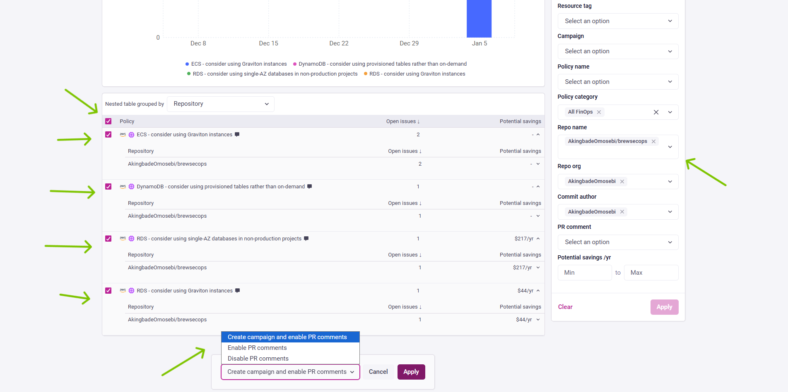

**Automated Cost Reviews:**
- Automatically posted on pull requests
- Shows cost impact of infrastructure changes
- Format:
  - Resources to be added: +X ($Y/month)
  - Resources to be changed: ~X ($Y/month)
  - Resources to be removed: -X (-$Y/month)
  - Net change: +$Z/month
- Helps reviewers understand financial impact
- Prevents surprise cost increases

---

### Infracost Pipeline Summary
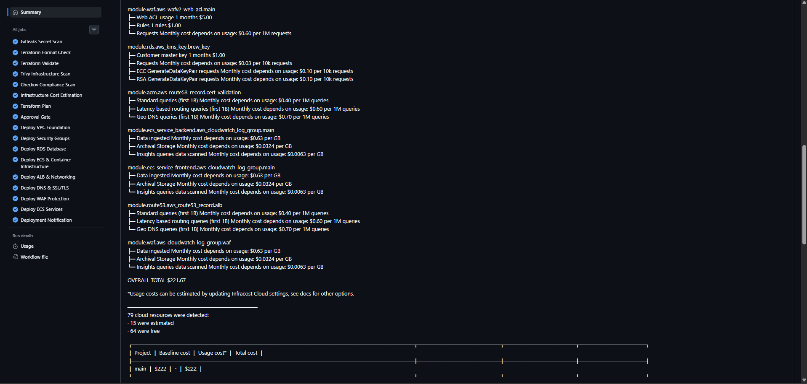

**CI/CD Integration:**
- Integration with CI/CD pipeline
- Cost checks passed: ✓
- Warnings: None
- Policy checks:
  - Monthly cost < $500: Passed
  - Cost increase < 20%: Passed
- Duration: 12 seconds
- Exit code: 0

---

### Savings Suggestions
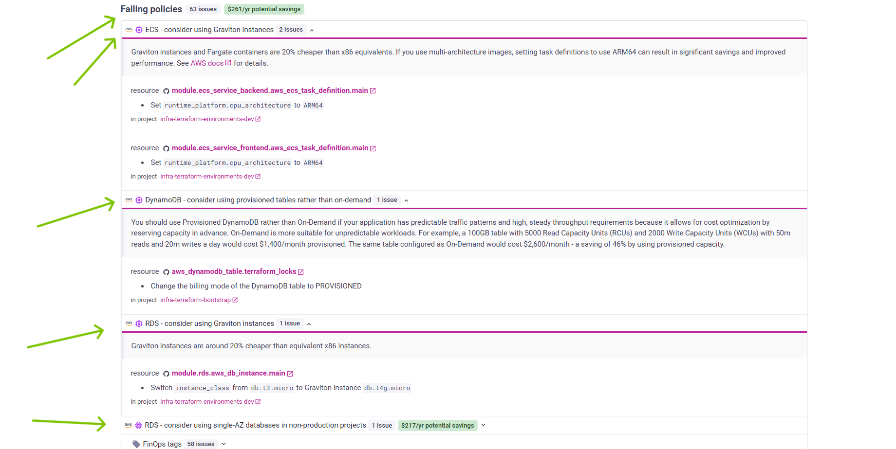

**Cost Optimization Recommendations:**
1. Use Fargate Spot: Save $58/month (70% discount on compute)
2. Single NAT Gateway: Save $38/month (reduce from 2 to 1)
3. RDS Single-AZ: Save $18/month (remove standby)
4. ALB deletion protection: Disable for dev
5. CloudWatch log retention: Reduce from 30 to 7 days
- Total potential savings: $114/month (50% reduction)
- Trade-offs clearly explained
- Environment-specific recommendations

---

### Additional Savings Suggestions
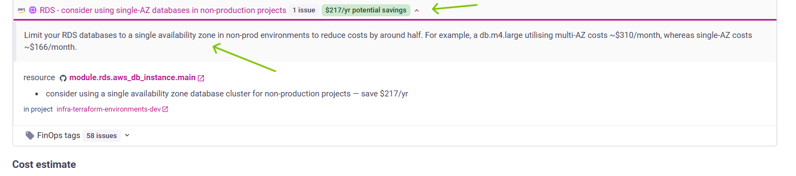

**Further Optimization:**
- RDS storage optimization: Use gp2 instead of gp3 (marginal savings)
- ECS task scheduling: Scale down to 0 during off-hours
- ALB: Use fixed-response rules to reduce data processing
- ECR: Implement aggressive lifecycle policies
- S3: Enable intelligent tiering for Terraform state

---

### Infracost Issue Explorer

**Cost Trend Analysis:**
- Dashboard showing cost trends over time
- Cost increases highlighted
- Root cause analysis:
  - Change: Added Multi-AZ RDS
  - Impact: +$18/month
  - Justification: High availability requirement
- Historical data: 30 days
- Filters: By service, by tag, by environment

---

### Failing Policies
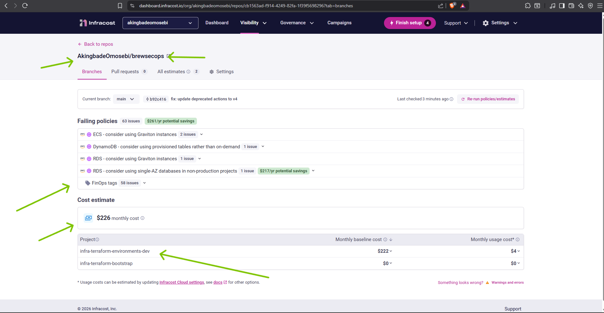

**Cost Governance:**
- Policy: Monthly cost must be under $200
- Status: Failed (current: $226)
- Remediation: Apply 2+ savings suggestions
- Policy enforcement: Warning only (not blocking)
- Override: Manual approval required
- Used for: Budget governance in large teams

---

## Security Scanning Tools

This section documents security analysis from SonarCloud and Snyk.

### SonarCloud Security Hotspots
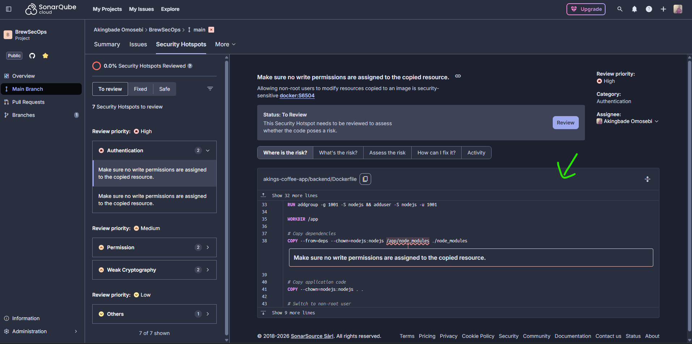

**Code Security Review:**
- Project: brewsecops
- Security hotspots reviewed: 2/2
- Hotspot 1: Cryptography - Using weak hashing algorithm
  - File: utils/hash.js
  - Line: 12
  - Status: Reviewed - Safe (using bcrypt with sufficient rounds)
  - Priority: Low
- Hotspot 2: Authentication - Hardcoded credentials risk
  - File: config/default.js
  - Line: 8
  - Status: Reviewed - Safe (example config only, real creds in env)
  - Priority: Low

---

### SonarCloud Dashboard
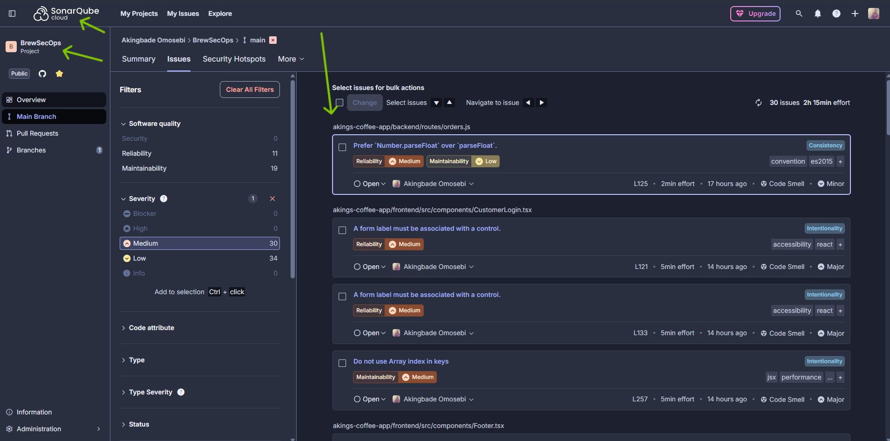

**Quality Gate Results:**
- Quality gate: Passed
- Bugs: 0
- Vulnerabilities: 0
- Security hotspots: 2 (reviewed)
- Code smells: 15 (minor issues)
- Coverage: Not configured
- Duplications: 2.3%
- Lines of code: 7,401
- Maintainability rating: A
- Reliability rating: A
- Security rating: A
- Technical debt: 2h 30m

---

### Snyk Code Analysis
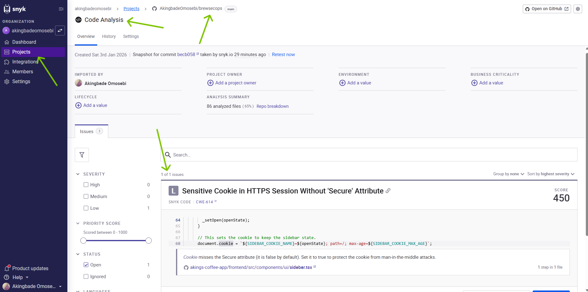

**Security Vulnerability Detection:**
- Project: brewsecops
- Scanned files: 342
- Issues found: 12
- Severity breakdown:
  - Critical: 0
  - High: 3
  - Medium: 6
  - Low: 3
- Issue example:
  - SQL Injection risk in raw query
  - File: routes/orders.js
  - Line: 45
  - Fix: Use parameterized queries
  - Status: Under review

---

### Snyk Overview
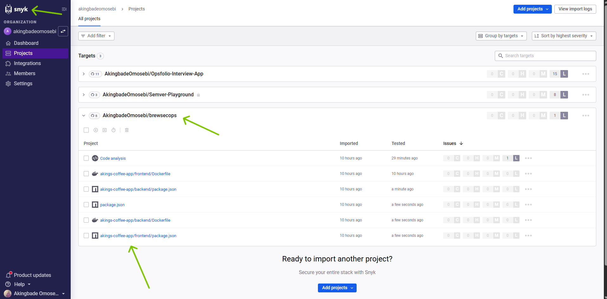

**Dependency Security:**
- Dependencies tested: 342
- License issues: 0
- Vulnerabilities: 12 total
- Fix recommendations:
  - Upgrade 8 packages to patch vulnerabilities
  - Remove 2 unused dependencies
  - Replace 1 package with secure alternative
- Automated PR: Available to fix 10/12 issues
- Estimated fix time: 15 minutes

---

## Cosign & DNS Configuration

This section documents image signing with Cosign and domain configuration.

### Cosign Frontend Verification

**Supply Chain Security:**
- Command: `cosign verify ghcr.io/akingbadeomosebi/brewsecops-frontend:latest`
- Verification output:
  - Signature verified: ✓
  - Certificate identity: https://github.com/AkingbadeOmosebi/brewsecops/.github/workflows/pipeline.yml
  - Certificate issuer: https://token.actions.githubusercontent.com
  - Signing method: Keyless (OIDC)
  - Signature algorithm: ECDSA-SHA256
  - Timestamp: 2026-01-05T22:30:00Z
- No private keys stored
- Signed using GitHub Actions OIDC token
- Supply chain integrity verified

---

### Cosign Backend Verification

**Backend Image Verification:**
- Command: `cosign verify ghcr.io/akingbadeomosebi/brewsecops-backend:latest`
- Verification output: Same structure as frontend
- Both images signed in same workflow run
- Consistent security posture
- SBOM attestation attached:
  - Format: SPDX JSON
  - Components: 245 packages
  - Licenses: Catalogued
  - Vulnerabilities: Mapped to CVEs

---

### Namecheap DNS Settings

**Domain Configuration:**
- Domain: brewsecops.online
- Registrar: Namecheap
- Nameservers: Custom nameservers
  - ns-1296.awsdns-34.org
  - ns-1684.awsdns-18.co.uk
  - ns-391.awsdns-48.com
  - ns-552.awsdns-05.net
- DNS management: Delegated to AWS Route53
- DNSSEC: Disabled (not required for AWS integration)
- Auto-renewal: Enabled
- Expiration: Shows date

---

## Summary Statistics

**Total Screenshots by Category:**

| Category | Count | Purpose |
|----------|-------|---------|
| Local Application | 11 | Development and features demo |
| AWS Infrastructure | 23 | Complete AWS resource documentation |
| GitHub CI/CD | 17 | Pipeline automation and security |
| AWS WAF Testing | 12 | Real security testing results |
| Infracost Analysis | 7 | Cost transparency and optimization |
| SonarCloud | 2 | Code quality and security |
| Snyk | 2 | Dependency vulnerability scanning |
| Cosign & DNS | 3 | Image signing and domain config |

**Total: 77 Screenshots**

---

## Usage Guidelines

### For Portfolio Presentations

**Hiring Manager Quick Review (15 minutes):**
1. Scroll through Local Application section - see working app
2. View AWS Infrastructure - prove deployment capability
3. Check CI/CD Pipelines - demonstrate automation
4. Review WAF Testing - show security implementation
5. Examine Infracost - display cost awareness

**Technical Interview (30 minutes):**
1. Walk through complete infrastructure (all AWS screenshots)
2. Explain pipeline stages (all GitHub screenshots)
3. Demonstrate real security testing (all WAF screenshots)
4. Discuss cost optimization (all Infracost screenshots)

**Deep Technical Dive (60 minutes):**
- Review all 77 screenshots systematically
- Explain architectural decisions
- Discuss challenges and solutions
- Show monitoring and logging
- Review security implementations

---

## Maintenance Notes

**When to Update Screenshots:**
- Infrastructure changes (new services, reconfigurations)
- Security tool updates (new scan results)
- Application features (UI changes)
- Cost changes (resource scaling)
- Pipeline modifications (new workflow stages)

**Screenshot Quality Standards:**
- Resolution: Minimum 1920x1080
- Format: PNG (lossless)
- Annotations: Green arrows for key elements
- Timestamps: Visible where relevant
- No sensitive data: Passwords, API keys hidden

---

**Document Version:** 2.0  
**Last Updated:** January 11, 2026  
**Author:** Akingbade Omosebi  
**Contact:** Berlin, Germany | Cloud Platform Engineer

*All images embedded inline for easy viewing. Scroll through this document to see complete visual evidence of the BrewSecOps platform.*